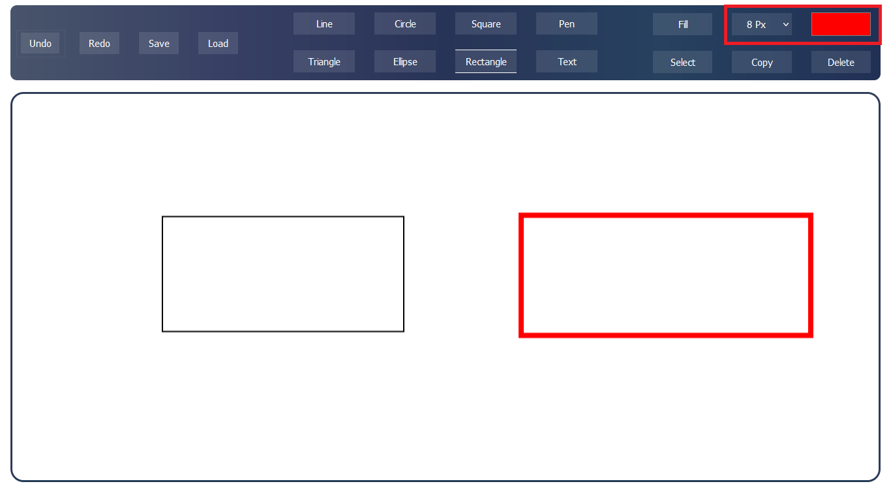
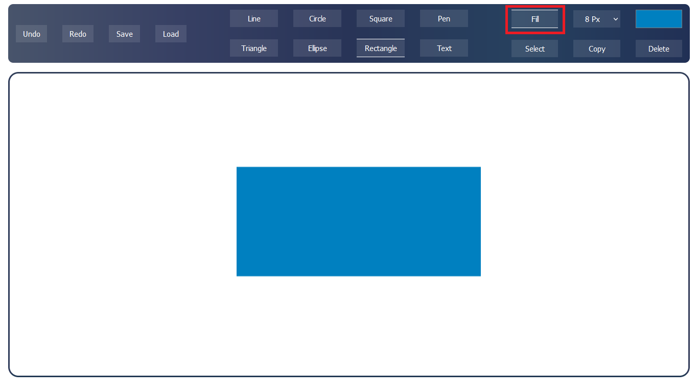
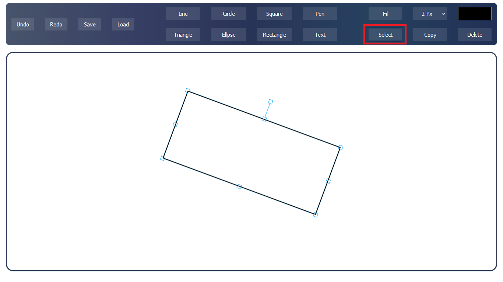
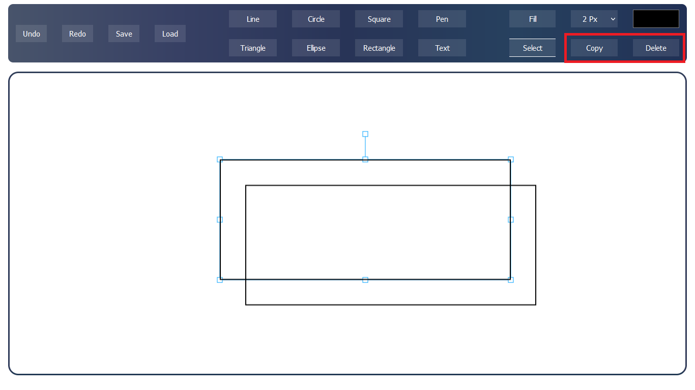
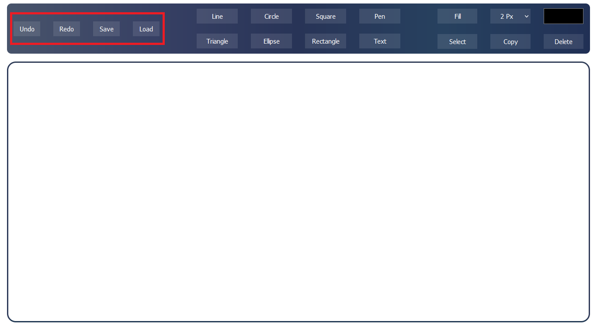

# Paint
This is a Paint web application built using Angular 15 and [Konva](https://github.com/konvajs/konva "Konva")
## Features
- Supports the following shapes:
  - Line
  - Triangle
  - Circle
  - Ellipse
  - Square
  - Rectangle
  - Pen
  - Text

------------
- The color and line width can be changed from here:

------------
- To fill a shape, click on "Fill" button, then draw the shape

------------
- Any shape can be moved, rotated, and resized. Click on "Select" button, then click on the shape

------------
- You can copy or delete any shape. First, select the shape, then click on "Copy" or "Delete"

------------
- You can undo or redo any action, and save and load the entire stage

